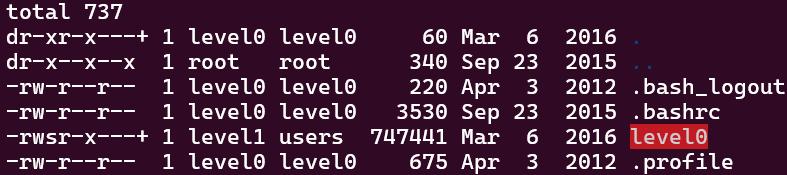

# LEVEL0

First, we need to establish an *SSH* connection to the virtual machine and log in using the password `level0`.

```sh
ssh level0@{VM_ip} -p 4242
```

Next, we can begin looking for potential vulnerabilities to exploit. Let’s check which files are available under the *level0* user.

```
ls -la
```


As we can see, there's a binary file. Let's see what it does!

```
./level0
```

When run without arguments, it causes a *Segmentation Fault*, and with one or more arguments, it prints "No !". To find a vulnerability we can exploit, we'll `reverse engineer` the executable. For this, we'll use the [Decompiler Explorer](Ressources/links) website.

> *Reverse Engineering* allows us to obtain the source code from the binary file.

In order to decompile the file, we need to transfer it to our local environment.

```
scp -P 4242 level0@{VM_ip}:level0 .
```

After decompiling, the [source code](source.c) shows a variable named *passcode* that checks if the first argument is equal to "0x1a7". If it matches, the code sets the GID and UID to the ones of the current process, then executes the command "/bin/sh". Otherwise, it simply writes the string "No!".\
After [converting](Ressources/links) the value "0x1a7" to decimal, we find that the value we need to input to pass this level is "423".

```
./level0 423
```

We now have a shell prompt with *level1* user permissions, allowing us to retrieve the flag for the next level!

```
cat /home/user/level1/.pass
```

**LEVEL0 COMPLETE!**