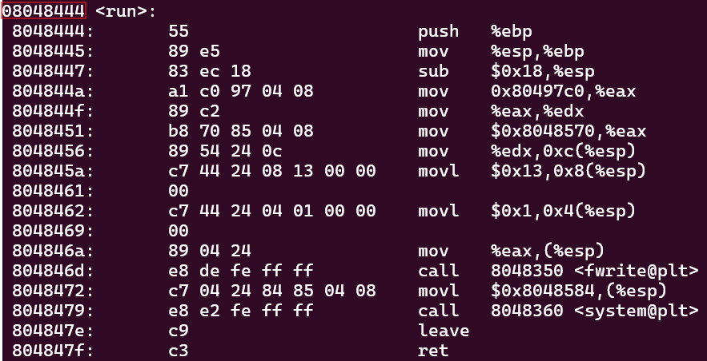

# LEVEL1

Going forward, we'll begin each level by:
1. Logging into the current level via SSH

```
ssh level{X}@{VM_IP} -p 4242
```

2. Transferring the binary file to our local environment

```
scp -P 4242 level{X}@{VM_IP}:level{X} .
```

3. Decompiling it

-> [Decompiler Explorer](Ressources/links)

---

In this level, the [source code](source.c) shows that the *main()* function calls *gets()* with a character array of size 76 as its argument. Additionally, we notice a *run()* function, which executes **"/bin/sh"**, but it is not invoked. This type of challenge is known as a `Ret2win`.

> A **Ret2win** challenge involves a hidden function that needs to be called but is not referenced or used in the *main()* function.

The vulnerability in this level lies in the use of *gets()*, which reads user input and stores it in a buffer without checking the input's length. This allows us to exploit a `buffer overflow` to call the *run()* function and retrieve the flag.

> A **Buffer Overflow** exploit takes advantage of the code overflowing into unintended areas of memory, allowing the attacker to overwrite data and potentially execute malicious code.

To achieve this, we'll craft a `payload` that injects the address of the *run()* function into memory. To obtain the function's address, we'll examine the object files.

```
objdump -d level1
```


Here, we can see that the function's address is *08048444*. Next, we'll fill the 76-byte buffer with random characters and then place this address in reverse order, as the system uses a 32-bit architecture, meaning it's `little-endian`. This address will occupy the next 4 bytes, causing the overflow.

> A **little-endian** system stores the least-significant byte at the smallest address.

When the overflow occurs, the 4 bytes containing the address of *run()* will overwrite adjacent memory locations. If the program continues running after the overflow, it can execute the *run()* function.

Finally, we can build the payload using the information we have gathered.

```
python -c 'print"A"*76 + "\x44\x84\x04\x08"' > /tmp/payload
```
And apply it on the binary.

```
cat /tmp/payload - | ./level1
```

We can now retrieve the flag for the *level2* user.

```
cat /home/user/level2/.pass
```

**LEVEL1 COMPLETE!**