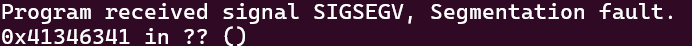
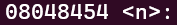

 ## LEVEL6

To start, we observe that this level does not use both *gets()* and *printf()*, ruling out a stack-based buffer overflow or format string attack. However, the presence of *malloc()* suggests we’ll need to exploit the heap. A 64-character buffer is allocated, which is then filled using *strcpy()* with the program's first argument. Additionally, there are two unused functions: *m()*, which prints "Nope" and *n()*, which displays the flag.

It's clear that we need to trigger a buffer overflow in the heap to overwrite memory and force the program to execute the function *n()*. To achieve this overflow, we'll need to determine the offset for the write location and obtain the address of *n()*.\
To find the offset, we'll use [Zerosum0x0](Ressources/links), which generates a non-repetitive pattern, allowing us to pinpoint the exact position of the overflow. We'll generate a 100-character pattern and pass it as an argument to the program.

```
> gdb -arg level6 Aa0Aa1Aa2Aa3Aa4Aa5Aa6Aa7Aa8Aa9Ab0Ab1Ab2Ab3Ab4Ab5Ab6Ab7Ab8Ab9Ac0Ac1Ac2Ac3Ac4Ac5Ac6Ac7Ac8Ac9Ad0Ad1Ad2A
> run
```


Next, we take the address where the segmentation fault occurs and [convert](Ressources/links) it to text to find the exact offset. The result is **Ac4A** (reverted because we're on little Endian), which we’ll input into the *Overflow Offset* field on Zerosum0x0 to get the offset. We observe it’s at the `72nd position`.\
Then, we'll find the address of *n()* by examining the disassembled code.

```
objdump -d level6
```


The addres of n() is `08048454`.

With all the information gathered, we can build the payload using the following template:\
`payload = A*72 + address to overwrite`

```
./level6 $(python -c 'print("A" * 72 + "\x54\x84\x04\x08")')
```

**LEVEL6 COMPLETE!**